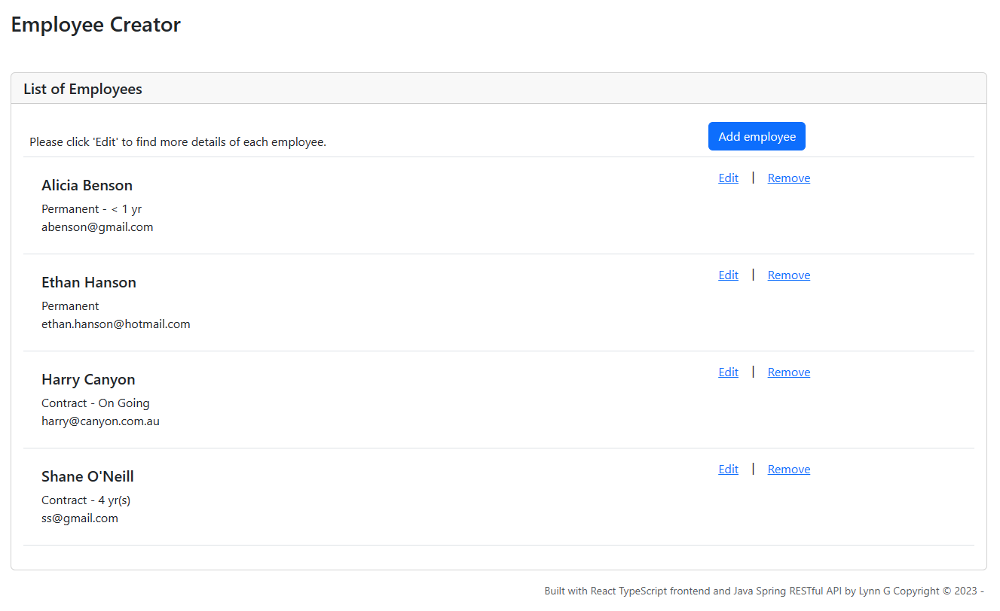
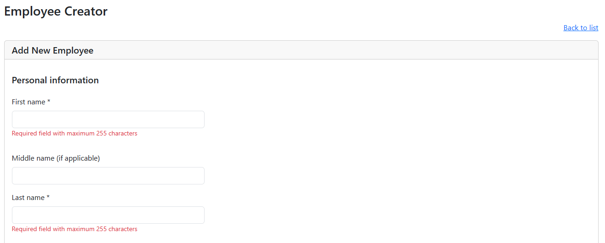
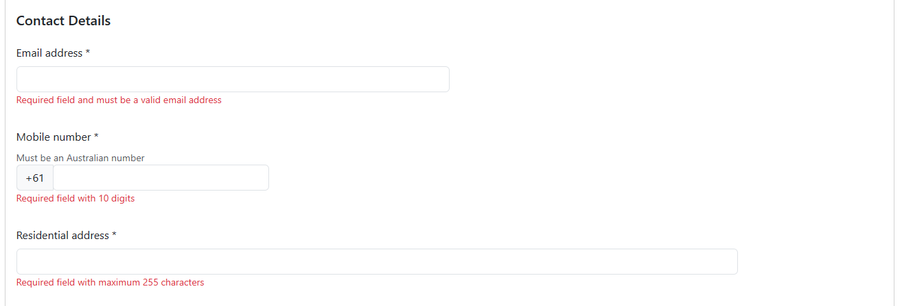
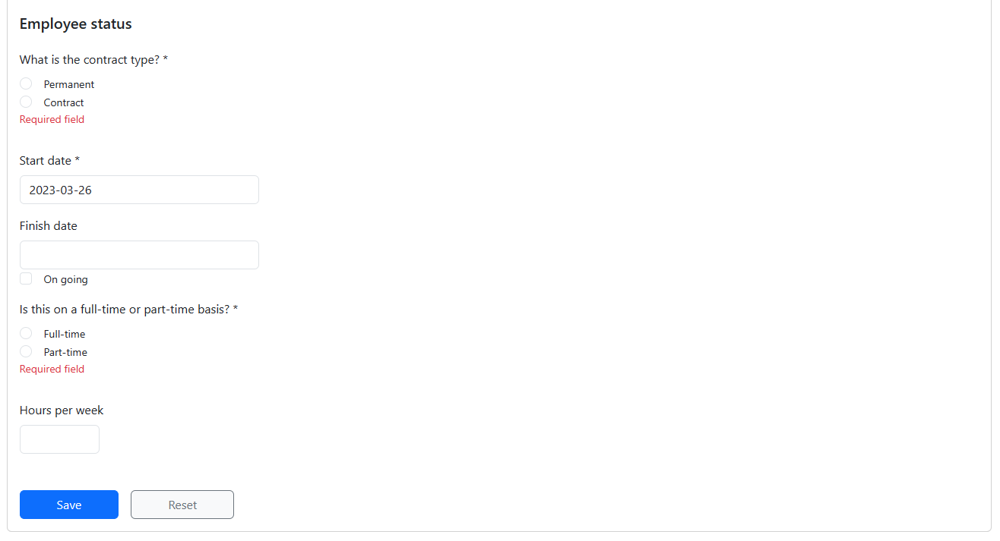

# Project: Employee Creator</a>

This is a web application to create, list, modify and delete employees.

## Outline

This project was designed to demonstrate my understanding of writing RESTful APIs in Java and frontend using React Typescript.

## Features

The Employee Creator website:

- Lists all active employees
- Allows the creation of new employee records
- Allows update of existing employee records
- Removes employee records by flagging them as archived

## Design Preview

